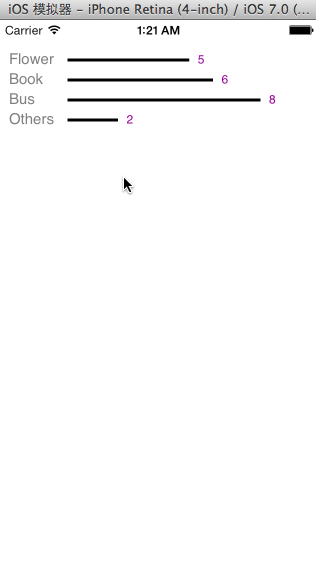

BarChart
========

A UIView For Draw Bar Chart

## How To Install

If you havn't used cocoapods, please visit [http://cocoapods.org/] to learn the basic usage.

* step1.  execute `pod init` in your command line and open your Podfile
* step2.  add `pod 'DBBarChart',:git=>'https://github.com/mengzhiqc/BarChart.git'` in your Podfile
* step3.  execute `pod install`

## How To Use 

* import the header file
    
    <pre>#import "DBBarChartView.h"</pre>

* prepare the data to be displayed

    eg.
<pre>
    NSArray *itemData = @[
                          @{@"itemName":@"Flower",@"value":@"5"},
                          @{@"itemName":@"Book",@"value":@"6"},
                          @{@"itemName":@"Bus",@"value":@"8"},
                          @{@"itemName":@"Others",@"value":@"2"},
                          ];
</pre>

* init barChartView and set delegate to current view controller
<pre>
    DBBarChartView *barChartView = [[DBBarChartView alloc]initWithData:itemData frame:CGRectMake(0, 20, 280, 100)];
    barChartView.delegate = self;
</pre>
please don't forget to add `BarChartViewDelegate` in your header file.

* add this view as subview
<pre>
    [self.view addSubview:barChartView];
</pre>
* result as follow

* we have provided some delegate so that you can change color and some other properties of chart view

<pre>
    - (UIColor *)barColorOfChartView:(DBBarChartView *)barChartView ;
    - (UIColor *)labelColorOfChartView:(DBBarChartView *)barChartView ;
    - (UIColor *)numberLabelcolorOfChartView:(DBBarChartView *)barChartView ;
    - (CGFloat)widthOfBarCharView:(DBBarChartView *)charView;
</pre>

